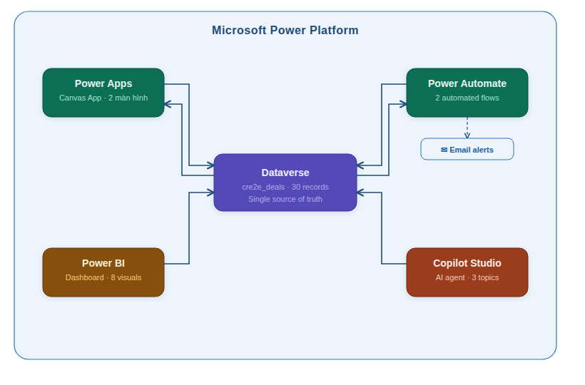
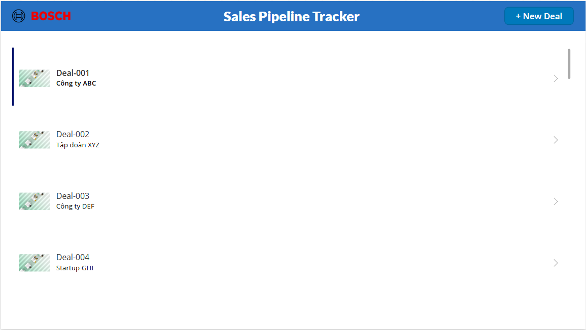
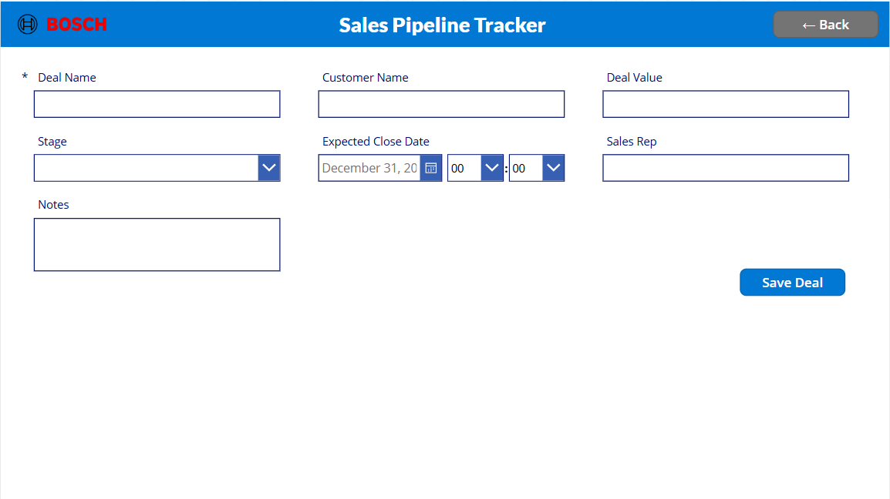
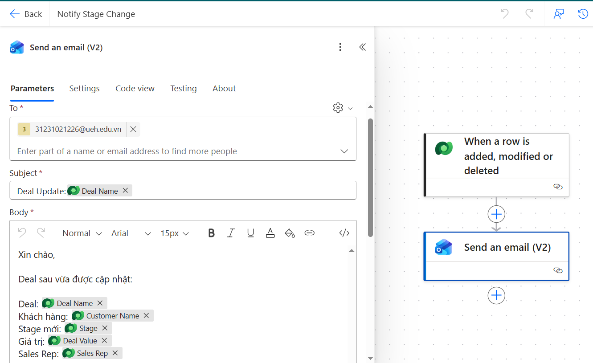
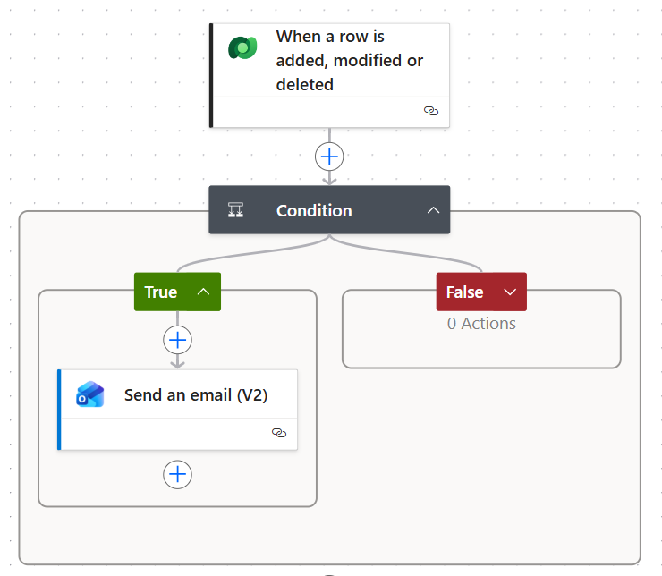
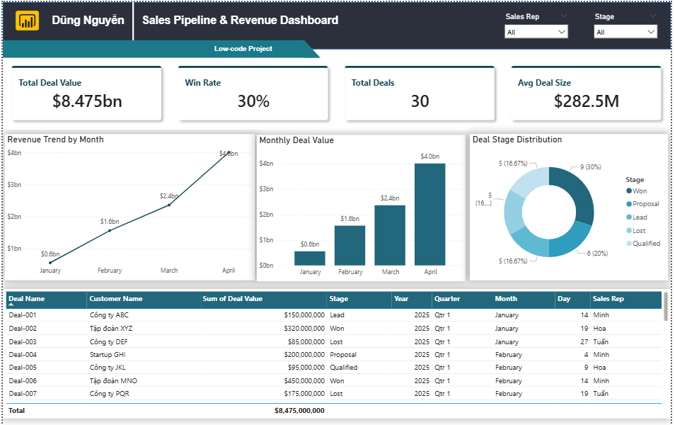
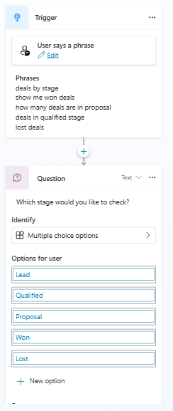
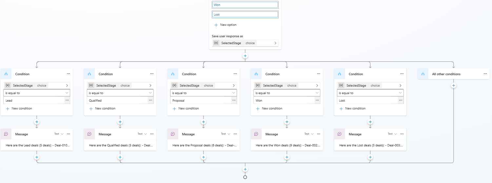

# 🚀 Sales Pipeline Tracker with AI Insights


> **Personal Portfolio Project** — End-to-end Low-Code CRM solution built entirely on Microsoft Power Platform, demonstrating hands-on skills in data analytics, business intelligence, process automation, and AI agent development.

---

## 📌 Project Overview

A fully functional **mini CRM system** that manages a 30-deal sales pipeline across 5 stages and 3 sales representatives. The system covers the complete Power Platform stack — from structured data storage to conversational AI querying — all within a single environment.

| Metric | Value |
|---|---|
| Total Pipeline Value | $8.475 Billion |
| Win Rate | 30% (9/30 deals) |
| Total Deals | 30 |
| Avg Deal Size | $282.5M |
| Data Period | Jan – Apr 2025 |

---

## 🏗️ System Architecture



**Dataverse** acts as the Single Source of Truth. All 5 components connect to a single environment (`ueh.edu.vn`), ensuring data consistency and reliability across the solution.

| Layer | Component | Role |
|---|---|---|
| Data | Dataverse | Centralized storage — `cre2e_deals` table, 30 records, 7 columns |
| Application | Power Apps | Canvas App UI — deal management with CRUD operations |
| Automation | Power Automate | Event-driven email notifications on row modifications |
| Analytics | Power BI | BI dashboard with DAX measure and multi-visual reporting |
| AI | Copilot Studio | Natural-language AI agent for pipeline queries |

---

## ⚙️ Components

### 1. Dataverse — Data Foundation
- Custom table `cre2e_deals` with 7 columns including Choice type for pipeline stages
- 5 stages: **Lead → Qualified → Proposal → Won → Lost**
- Bulk data import via CSV; shared across all platform components

### 2. Power Apps — Canvas Application
- Tablet-format Canvas App with 2 screens: **DealListScreen** and **DealFormScreen**
- Live Gallery connected to Dataverse — displays all 30 deals in real time
- Full CRUD: add new deal → submit form → auto-save to Dataverse

| Screenshot | |
|---|---|
| Deal List Screen | Deal Form Screen |
|  |  |

### 3. Power Automate — Process Automation
Two automated cloud flows triggered on Dataverse row modification:

- **Flow 1 — Notify Stage Change**: Sends email notification on any deal update (Deal Name, Customer, Stage, Value, Rep)
- **Flow 2 — Congrats Won Deal**: Conditional logic — sends congratulatory email only when `Stage = "Won"`

| Screenshot | |
|---|---|
| Flow 1 | Flow 2 (Condition branching) |
|  |  |

### 4. Power BI — Analytics Dashboard
- Connected to Dataverse via **Import mode**
- **Power Query** transformation: removed duplicate numeric stage column, renamed columns
- **1 custom DAX measure:**
```dax
Win Rate = 
DIVIDE(
    COUNTROWS(FILTER('cre2e_deals', 'cre2e_deals'[Stage] = "Won")),
    COUNTROWS('cre2e_deals'),
    0
) * 100
```
- **8 visuals**: 4 KPI Cards, Bar Chart, Column Chart, Donut Chart, Detail Table
- **2 Slicers**: Filter by Sales Rep and Stage



### 5. Copilot Studio — AI Sales Assistant
Natural-language AI agent with 3 structured topics:

| Topic | Trigger Example | Response |
|---|---|---|
| Deals Closing Soon | *"which deals are closing this week"* | List of 4 soonest-closing deals |
| Total Revenue | *"what is our win rate"* | Full KPI summary + per-rep breakdown |
| Deals By Stage | *"show me won deals"* | Bot asks stage → returns filtered list |




---

## 🎯 Skills Demonstrated

| JD Requirement | Implementation |
|---|---|
| Power BI dashboards, data models, DAX | 8-visual dashboard with custom DAX measure and Power Query transformation |
| Data accuracy across multiple sources | Single-source Dataverse architecture; Power Query data cleaning pipeline |
| Power Apps & Power Automate | 2-screen Canvas App + 2 automated flows with conditional logic |
| Dataverse | Custom table design, Choice columns, bulk import, cross-component integration |
| Business process automation | Event-driven flows with condition branching and email connector |
| Copilot Studio / AI tooling | 3-topic AI agent with NLP triggers, question nodes, choice variables |
| Digital transformation mindset | End-to-end solution: data layer → UI → automation → BI → AI |

---

## 📁 Repository Structure

```
[Low-code Project][Sales Pipeline Tracker]/
│
├── README.md
│
├── solution/
│   └── Crceabc_1_0_0_1.zip          ← Unmanaged solution (importable)
│
├── docs/
│   ├── [Report][Low-code Project].docx
│   ├── [Report][Low-code Project].pdf
│   ├── architecture_diagram.png
│   ├── Low-Code Project Dashboard.pdf
│   ├── Low-Code Project Dashboard.pbix
│   └── screenshots/
│       ├── power_apps_list_screen.png
│       ├── power_apps_form_screen.png
│       ├── power_automate_flow1.png
│       ├── power_automate_flow2.png
│       ├── power_bi_dashboard.png
│       ├── copilot_studio_topic3_a.png
│       └── copilot_studio_topic3_b.png
│
└── data/
    └── deals_sample.csv              ← 30 synthetic deals (UTF-8)
```

---

## 🔧 How to Import the Solution

1. Go to [make.powerapps.com](https://make.powerapps.com)
2. Navigate to **Solutions** → **Import solution**
3. Upload `solution/Crceabc_1_0_0_1.zip`
4. Follow the import wizard — select **Unmanaged**
5. Reconnect any required connections (Dataverse, Outlook)

---

## 👤 Author

**Nguyen Loi Thanh Dung**
Bachelor of Data Science — University of Economics Ho Chi Minh City (UEH)
GPA: 3.79 / 4.0 | IELTS 7.0

[](https://github.com/dg-ng)
[](https://linkedin.com/in/dung-nguyen070205)
[](mailto:dungnguyenbo@gmail.com)
